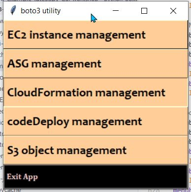
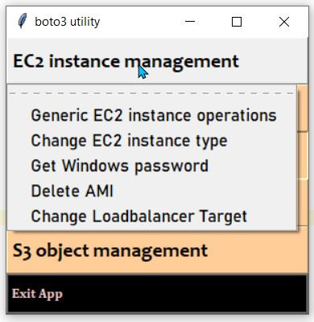
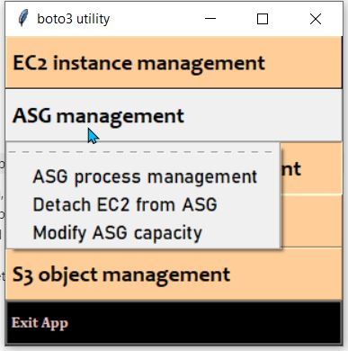
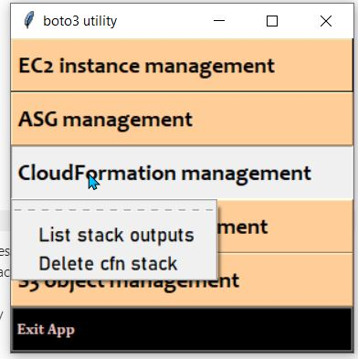
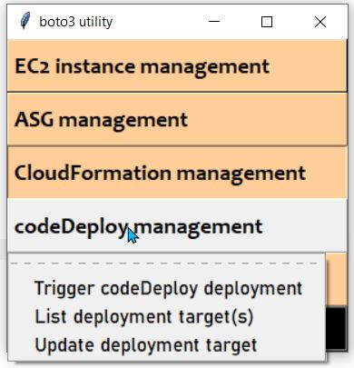
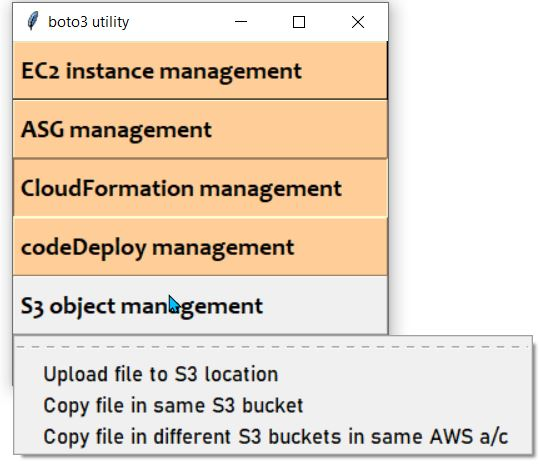

-----------------------------------------
------python-boto3-aws-utility-app-------
-----------------------------------------

This is a simple Python GUI application built using Python out-of-box Tkinter and AWS boto3 library.
The group of tasks are divided in 4 broad categories

- EC2
- ASG
- CloudFormation
- CodeDeploy
- S3


> Please install Python 3.7.3 and other dependant libraries from ./requirements.txt using the following command 

``` python
pip install -r requirements.txt
```
> Please get SAML token , before running the application

``` powershell
aws-azure-login.cmd login --profile saml
```
> AWS EC2 Keypair location, please update the below location with keypair location in *boto3automationlibrary.py*
``` python
privKeyfile_generic_int = r'C:\Users\<<location>>\luv-dev-keypair.pem'

privKeyfile_landata_uat = r'C:\Users\<<location>>\landata-uat-201807.pem'
privKeyfile_landata_prd = r'C:\Users\<<location>>\landata-prd-keypair-201808.pem'

privKeyfile_lassi_uat = r'C:\Users\<<location>>\lassi-uat-keypair-201805.pem'
privKeyfile_lassi_prd = r'C:\Users\<<location>>\lassi-prd-keypair-201807'

privKeyfile_vots_uat = r'C:\Users\<<location>>\vots-uat-28082018.pem'
privKeyfile_vots_prd = r'C:\Users\<<location>>\vots-prd-keypair-20180831.pem'

privKeyfile_pcs_prd = r'C:\Users\<<location>>\pcs-prd-keypair-201809.pem'

privKeyfile_reports_uat = r'C:\Users\<<location>>\reports-uat-keypair-20180925.pem'
privKeyfile_reports_prd = r'C:\Users\<<location>>\reports-prd-keypair-20181014.pem'

privKeyfile_rmq_prd = r'C:\Users\<<location>>\rabbitmq-prd-keypair-201806.pem'
privKeyfile_rmq_uat = r'C:\Users\<<location>>\rabbitmq-uat-keypair-201804.pem'

```



> **EC2 management**

- Generic EC2 instances operations --> like starting, rebooting, terminating EC2 instance,
adding EC2 tags.
- Change EC2 instance type --> change instance type of a stopped instance
- Get Windows password --> Retrieve Administrator password
- Delete AMI --> Delete snapshot and de-register AMI
- Change LoadBalancer target --> changes loadBalancer target





> **ASG management**

- ASG process management --> Resume/ Suspend ASG processes
- Detach EC2 from ASG --> This allows an instance to be detached from ASG, please check
DesiredCapacity value, before executing this.
- Modify ASG capacity --> Change max, min, DesiredCapacity




>**CloudFormation management**
- List cfn stack outputs [ *WIP* ]
- Delete cfn stack
  


> **CodeDeploy management**
- Trigger deployment --> Select app, env and component eg *vots-ops-app*
- List deployment targets --> List deployment targets of codeDeploy application
- Update deployment target --> Updates deployment target [ updating multiple targets to be added ]
  


> **S3 management**
- Upload file to S3 location
- Copy file in same S3 bucket
- Copy filein different S3 buckets in same AWS account




